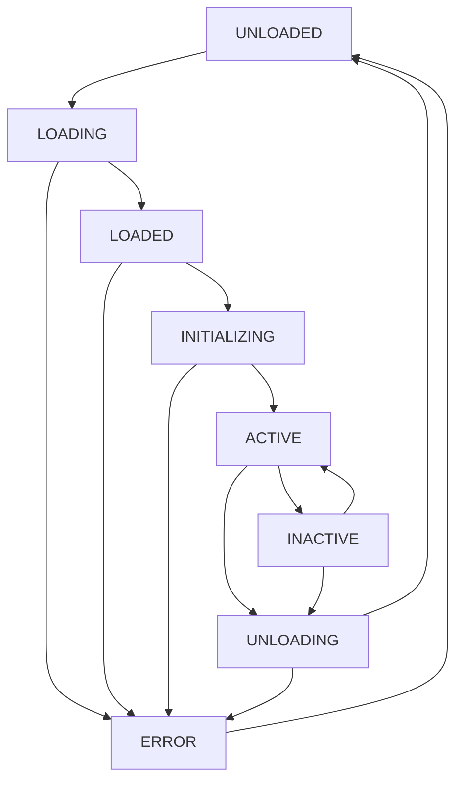

# MemoryNote 插件系统开发文档

## 项目概述

MemoryNote插件系统是一个强大而灵活的扩展架构，允许第三方开发者通过插件来扩展应用的核心功能。插件系统采用基于事件驱动的钩子架构，提供丰富的API接口，支持UI扩展、功能增强、算法替换等多种扩展方式。

---

## 系统架构设计

### 整体架构图

```
┌─────────────────────────────────────────────────────────────────────────────────┐
│                           MemoryNote 插件系统架构                                │
├─────────────────────────────────────────────────────────────────────────────────┤
│  应用层 (Application Layer)                                                      │
│  ┌─────────────┐ ┌─────────────┐ ┌─────────────┐ ┌─────────────┐              │
│  │  编辑器     │ │  侧边栏     │ │  复习系统   │ │  设置面板   │              │
│  └─────────────┘ └─────────────┘ └─────────────┘ └─────────────┘              │
├─────────────────────────────────────────────────────────────────────────────────┤
│  插件接口层 (Plugin Interface Layer)                                            │
│  ┌─────────────┐ ┌─────────────┐ ┌─────────────┐ ┌─────────────┐              │
│  │  UI扩展API  │ │  数据API    │ │  算法API    │ │  系统API    │              │
│  └─────────────┘ └─────────────┘ └─────────────┘ └─────────────┘              │
├─────────────────────────────────────────────────────────────────────────────────┤
│  插件管理层 (Plugin Management Layer)                                           │
│  ┌─────────────┐ ┌─────────────┐ ┌─────────────┐ ┌─────────────┐              │
│  │  插件加载器 │ │  生命周期   │ │  钩子系统   │ │  依赖管理   │              │
│  └─────────────┘ └─────────────┘ └─────────────┘ └─────────────┘              │
├─────────────────────────────────────────────────────────────────────────────────┤
│  插件沙箱层 (Plugin Sandbox Layer)                                              │
│  ┌─────────────┐ ┌─────────────┐ ┌─────────────┐ ┌─────────────┐              │
│  │  权限控制   │ │  资源隔离   │ │  错误隔离   │ │  安全检查   │              │
│  └─────────────┘ └─────────────┘ └─────────────┘ └─────────────┘              │
├─────────────────────────────────────────────────────────────────────────────────┤
│  插件运行时 (Plugin Runtime)                                                    │
│  ┌─────────────────────────────────────────────────────────────────────────────┐ │
│  │  插件A       插件B       插件C       插件D       插件E                      │ │
│  │  ┌─────────┐ ┌─────────┐ ┌─────────┐ ┌─────────┐ ┌─────────────┐           │ │
│  │  │UI扩展   │ │Diff算法 │ │复习算法 │ │快捷键   │ │主题扩展     │           │ │
│  │  └─────────┘ └─────────┘ └─────────┘ └─────────┘ └─────────────┘           │ │
│  └─────────────────────────────────────────────────────────────────────────────┘ │
└─────────────────────────────────────────────────────────────────────────────────┘
```

### 核心组件说明

#### 1. 插件管理器 (PluginManager)
- **职责**: 插件的加载、卸载、启用、禁用
- **功能**: 插件依赖解析、版本管理、冲突检测
- **接口**: 插件注册、查询、生命周期管理

#### 2. 钩子系统 (Hook System)
- **职责**: 事件驱动的扩展点管理
- **功能**: 钩子注册、触发、优先级控制
- **接口**: 同步/异步钩子、条件钩子、管道钩子

#### 3. API 注册中心 (API Registry)
- **职责**: 插件API的注册和发现
- **功能**: 接口版本控制、兼容性检查
- **接口**: API注册、调用代理、权限验证

#### 4. 沙箱环境 (Sandbox)
- **职责**: 插件运行时的安全隔离
- **功能**: 资源访问控制、错误隔离、性能监控
- **接口**: 受限的全局对象、安全的API访问

---

## 插件生命周期

### 生命周期阶段

```typescript
enum PluginLifecycle {
  UNLOADED = 'unloaded',      // 未加载
  LOADING = 'loading',        // 加载中
  LOADED = 'loaded',          // 已加载
  INITIALIZING = 'initializing', // 初始化中
  ACTIVE = 'active',          // 活跃状态
  INACTIVE = 'inactive',      // 非活跃状态
  UNLOADING = 'unloading',    // 卸载中
  ERROR = 'error'             // 错误状态
}
```

### 生命周期流程



### 生命周期钩子

```typescript
interface PluginLifecycleHooks {
  onLoad?(): Promise<void>           // 插件加载时
  onInitialize?(): Promise<void>     // 插件初始化时
  onActivate?(): Promise<void>       // 插件激活时
  onDeactivate?(): Promise<void>     // 插件停用时
  onUnload?(): Promise<void>         // 插件卸载时
  onError?(error: Error): Promise<void> // 插件出错时
  onUpdate?(oldVersion: string, newVersion: string): Promise<void> // 插件更新时
}
```

---

## 插件接口定义

### 1. 基础插件接口

```typescript
// 插件元信息
interface PluginManifest {
  id: string                         // 插件唯一标识
  name: string                       // 插件名称
  version: string                    // 版本号 (语义化版本)
  description: string                // 插件描述
  author: string                     // 作者信息
  license: string                    // 许可证
  homepage?: string                  // 主页链接
  repository?: string                // 仓库链接
  
  // 依赖和兼容性
  engines: {
    memorynote: string               // 支持的应用版本范围
  }
  dependencies?: Record<string, string> // 插件依赖
  peerDependencies?: Record<string, string> // 同级依赖
  
  // 扩展点声明
  contributes: {
    commands?: CommandContribution[]  // 命令贡献
    keybindings?: KeybindingContribution[] // 快捷键贡献
    sidebar?: SidebarContribution[]   // 侧边栏贡献
    algorithms?: AlgorithmContribution[] // 算法贡献
    themes?: ThemeContribution[]      // 主题贡献
    languages?: LanguageContribution[] // 语言贡献
  }
  
  // 权限声明
  permissions: PluginPermission[]
  
  // 插件配置模式
  configurationSchema?: JSONSchema
}

// 插件主类接口
interface Plugin {
  readonly manifest: PluginManifest
  readonly context: PluginContext
  
  // 生命周期方法
  onLoad?(): Promise<void>
  onInitialize?(): Promise<void>
  onActivate?(): Promise<void>
  onDeactivate?(): Promise<void>
  onUnload?(): Promise<void>
  onError?(error: Error): void
  
  // 扩展点注册
  registerExtensions?(): void
}
```

### 2. 插件上下文接口

```typescript
interface PluginContext {
  // 基础信息
  readonly pluginId: string
  readonly pluginPath: string
  readonly isDev: boolean
  
  // API 访问
  readonly api: PluginAPI
  readonly logger: PluginLogger
  readonly storage: PluginStorage
  readonly config: PluginConfig
  
  // 事件系统
  readonly events: PluginEventEmitter
  readonly hooks: PluginHookRegistry
  
  // 资源管理
  readonly disposables: DisposableRegistry
  
  // 插件间通信
  readonly messaging: PluginMessaging
}
```

### 3. 核心API接口

```typescript
interface PluginAPI {
  // UI 扩展API
  ui: {
    // 侧边栏扩展
    sidebar: {
      registerPanel(panel: SidebarPanel): Disposable
      updatePanel(id: string, updates: Partial<SidebarPanel>): void
      removePanel(id: string): void
      getPanel(id: string): SidebarPanel | undefined
    }
    
    // 导航栏扩展
    navigation: {
      addButton(button: NavigationButton): Disposable
      removeButton(id: string): void
      updateButton(id: string, updates: Partial<NavigationButton>): void
    }
    
    // 编辑器扩展
    editor: {
      registerAction(action: EditorAction): Disposable
      registerDecorator(decorator: EditorDecorator): Disposable
      registerCompletionProvider(provider: CompletionProvider): Disposable
    }
    
    // 右键菜单扩展
    contextMenu: {
      registerMenuItem(item: ContextMenuItem): Disposable
      registerMenuGroup(group: ContextMenuGroup): Disposable
    }
    
    // 状态栏扩展
    statusBar: {
      addItem(item: StatusBarItem): Disposable
      updateItem(id: string, updates: Partial<StatusBarItem>): void
      removeItem(id: string): void
    }
    
    // 对话框和通知
    dialog: {
      showInformation(message: string, ...items: string[]): Promise<string | undefined>
      showWarning(message: string, ...items: string[]): Promise<string | undefined>
      showError(message: string, ...items: string[]): Promise<string | undefined>
      showInputBox(options: InputBoxOptions): Promise<string | undefined>
    }
    
    // 自定义窗口
    window: {
      createWindow(options: WindowOptions): Promise<PluginWindow>
      getActiveWindow(): PluginWindow | undefined
      getAllWindows(): PluginWindow[]
    }
  }
  
  // 数据访问API
  data: {
    // 文件系统
    fs: {
      readFile(path: string): Promise<string>
      writeFile(path: string, content: string): Promise<void>
      exists(path: string): Promise<boolean>
      stat(path: string): Promise<FileStat>
      readdir(path: string): Promise<string[]>
      watch(path: string, callback: FileWatchCallback): Disposable
    }
    
    // 数据库访问
    database: {
      notes: NotesAPI
      reviews: ReviewsAPI
      categories: CategoriesAPI
      settings: SettingsAPI
      custom: CustomDatabaseAPI
    }
    
    // 差异算法API
    diff: {
      registerAlgorithm(algorithm: DiffAlgorithm): Disposable
      getDiffResult(oldContent: string, newContent: string, algorithmId?: string): DiffResult
      applyDiff(content: string, diff: DiffResult): string
    }
  }
  
  // 复习系统API
  review: {
    // 算法注册
    algorithms: {
      register(algorithm: ReviewAlgorithm): Disposable
      unregister(algorithmId: string): void
      getAlgorithm(algorithmId: string): ReviewAlgorithm | undefined
      listAlgorithms(): ReviewAlgorithm[]
    }
    
    // 复习卡片管理
    cards: {
      create(card: Partial<ReviewCard>): Promise<ReviewCard>
      update(cardId: string, updates: Partial<ReviewCard>): Promise<void>
      delete(cardId: string): Promise<void>
      get(cardId: string): Promise<ReviewCard | undefined>
      list(filters?: ReviewCardFilters): Promise<ReviewCard[]>
    }
    
    // 复习会话
    sessions: {
      start(options: ReviewSessionOptions): Promise<ReviewSession>
      end(sessionId: string): Promise<void>
      getCurrentSession(): ReviewSession | undefined
    }
  }
  
  // 系统API
  system: {
    // 命令系统
    commands: {
      register(command: Command): Disposable
      execute(commandId: string, ...args: any[]): Promise<any>
      getCommand(commandId: string): Command | undefined
    }
    
    // 快捷键系统
    keybindings: {
      register(keybinding: Keybinding): Disposable
      unregister(keybindingId: string): void
      updateKeybinding(keybindingId: string, newKey: string): void
    }
    
    // 主题系统
    themes: {
      register(theme: Theme): Disposable
      apply(themeId: string): Promise<void>
      getCurrentTheme(): Theme | undefined
    }
    
    // 配置系统
    configuration: {
      get<T>(key: string, defaultValue?: T): T
      set(key: string, value: any): Promise<void>
      onDidChange(callback: ConfigChangeCallback): Disposable
    }
    
    // 工作区
    workspace: {
      getPath(): string | undefined
      onDidChangeWorkspace(callback: WorkspaceChangeCallback): Disposable
      openFile(path: string): Promise<void>
      createFile(path: string, content?: string): Promise<void>
    }
  }
}
```

---

## 扩展点详细设计

### 1. 侧边栏扩展

```typescript
// 侧边栏面板定义
interface SidebarPanel {
  id: string                         // 面板唯一标识
  title: string                      // 面板标题
  icon: string | VueComponent        // 面板图标
  component: VueComponent            // 面板组件
  position: number                   // 显示位置权重
  when?: string                      // 显示条件表达式
  contextMenu?: ContextMenuItem[]    // 右键菜单
  toolbar?: ToolbarItem[]            // 工具栏按钮
}

// 侧边栏面板组件接口
interface SidebarPanelComponent {
  // 面板激活时调用
  onActivate?(): void
  
  // 面板停用时调用
  onDeactivate?(): void
  
  // 面板销毁时调用
  onDestroy?(): void
  
  // 面板接收焦点时调用
  onFocus?(): void
  
  // 面板失去焦点时调用
  onBlur?(): void
}

// 使用示例
class MyPlugin implements Plugin {
  onActivate() {
    // 注册侧边栏面板
    this.context.api.ui.sidebar.registerPanel({
      id: 'my-plugin.sidebar-panel',
      title: '我的工具',
      icon: '🔧',
      component: MySidebarComponent,
      position: 100,
      when: 'workspaceOpen'
    })
  }
}
```

### 2. 导航栏扩展

```typescript
// 导航按钮定义
interface NavigationButton {
  id: string                         // 按钮唯一标识
  label: string                      // 按钮标签
  icon: string | VueComponent        // 按钮图标
  tooltip?: string                   // 悬停提示
  position: number                   // 显示位置权重
  command?: string                   // 关联命令
  when?: string                      // 显示条件
  badge?: {                          // 徽章显示
    text: string
    color: string
  }
}

// 使用示例
this.context.api.ui.navigation.addButton({
  id: 'my-plugin.nav-button',
  label: '插件功能',
  icon: '⚡',
  tooltip: '点击打开插件功能',
  position: 200,
  command: 'my-plugin.open-feature'
})
```

### 3. 编辑器扩展

```typescript
// 编辑器操作定义
interface EditorAction {
  id: string                         // 操作唯一标识
  label: string                      // 操作标签
  description?: string               // 操作描述
  keybinding?: string                // 快捷键
  when?: string                      // 触发条件
  handler: EditorActionHandler       // 处理函数
}

interface EditorActionHandler {
  (editor: Editor, selection: EditorSelection): Promise<void> | void
}

// 编辑器装饰器
interface EditorDecorator {
  id: string                         // 装饰器标识
  matcher: TextMatcher               // 文本匹配器
  decorator: DecorationRenderer      // 装饰渲染器
  priority: number                   // 优先级
}

// 自动完成提供者
interface CompletionProvider {
  id: string                         // 提供者标识
  triggerCharacters: string[]        // 触发字符
  provider: CompletionItemProvider   // 完成项提供者
}

// 使用示例
this.context.api.ui.editor.registerAction({
  id: 'my-plugin.format-text',
  label: '格式化文本',
  keybinding: 'Ctrl+Shift+F',
  when: 'editorHasSelection',
  handler: async (editor, selection) => {
    const selectedText = editor.getSelectedText()
    const formattedText = await this.formatText(selectedText)
    editor.replaceSelection(formattedText)
  }
})
```

### 4. 差异算法扩展

```typescript
// 差异算法接口
interface DiffAlgorithm {
  id: string                         // 算法唯一标识
  name: string                       // 算法名称
  description: string                // 算法描述
  version: string                    // 算法版本
  
  // 计算差异
  computeDiff(oldContent: string, newContent: string, options?: DiffOptions): Promise<DiffResult>
  
  // 应用差异
  applyDiff(content: string, diff: DiffResult): Promise<string>
  
  // 算法配置
  getConfiguration(): DiffConfiguration
  setConfiguration(config: Partial<DiffConfiguration>): void
}

// 差异结果定义
interface DiffResult {
  changes: DiffChange[]              // 变更列表
  metadata: {                        // 元数据
    algorithmId: string
    timestamp: number
    statistics: DiffStatistics
  }
}

interface DiffChange {
  type: 'insert' | 'delete' | 'modify' // 变更类型
  position: TextPosition             // 文本位置
  oldText?: string                   // 原文本
  newText?: string                   // 新文本
  confidence?: number                // 置信度
}

// 使用示例
class SemanticDiffAlgorithm implements DiffAlgorithm {
  id = 'semantic-diff'
  name = '语义差异算法'
  description = '基于语义分析的智能差异检测'
  version = '1.0.0'
  
  async computeDiff(oldContent: string, newContent: string): Promise<DiffResult> {
    // 实现语义差异算法
    const changes = await this.analyzeSemanticChanges(oldContent, newContent)
    return {
      changes,
      metadata: {
        algorithmId: this.id,
        timestamp: Date.now(),
        statistics: this.calculateStatistics(changes)
      }
    }
  }
  
  // 注册算法
  onActivate() {
    this.context.api.data.diff.registerAlgorithm(this)
  }
}
```

### 5. 复习算法扩展

```typescript
// 复习算法接口
interface ReviewAlgorithm {
  id: string                         // 算法唯一标识
  name: string                       // 算法名称
  description: string                // 算法描述
  version: string                    // 算法版本
  
  // 计算下次复习时间
  calculateNextReview(
    card: ReviewCard, 
    rating: ReviewRating, 
    context?: ReviewContext
  ): Promise<ReviewSchedule>
  
  // 初始化卡片参数
  initializeCard(card: Partial<ReviewCard>): Promise<ReviewCard>
  
  // 更新算法参数
  updateParameters(card: ReviewCard, rating: ReviewRating): Promise<void>
  
  // 获取算法统计
  getStatistics(cards: ReviewCard[]): Promise<AlgorithmStatistics>
  
  // 算法配置
  getConfiguration(): AlgorithmConfiguration
  setConfiguration(config: Partial<AlgorithmConfiguration>): void
}

// 复习调度结果
interface ReviewSchedule {
  nextReviewDate: Date               // 下次复习日期
  interval: number                   // 复习间隔(天)
  easeFactor?: number                // 难度因子
  confidence?: number                // 算法置信度
  metadata?: Record<string, any>     // 算法特定数据
}

// 使用示例
class CustomSpacedRepetitionAlgorithm implements ReviewAlgorithm {
  id = 'custom-sr'
  name = '自定义间隔重复'
  description = '改进的间隔重复算法'
  version = '1.0.0'
  
  async calculateNextReview(card: ReviewCard, rating: ReviewRating): Promise<ReviewSchedule> {
    // 实现自定义算法逻辑
    const interval = this.calculateInterval(card, rating)
    const nextDate = new Date()
    nextDate.setDate(nextDate.getDate() + interval)
    
    return {
      nextReviewDate: nextDate,
      interval,
      easeFactor: this.updateEaseFactor(card.easeFactor, rating),
      confidence: 0.95
    }
  }
  
  // 注册算法
  onActivate() {
    this.context.api.review.algorithms.register(this)
  }
}
```

### 6. 快捷键扩展

```typescript
// 快捷键定义
interface Keybinding {
  id: string                         // 快捷键唯一标识
  key: string                        // 按键组合
  command: string                    // 关联命令
  when?: string                      // 触发条件
  args?: any[]                       // 命令参数
  priority?: number                  // 优先级
}

// 快捷键上下文
interface KeybindingContext {
  activeEditor: boolean              // 编辑器激活状态
  editorHasSelection: boolean        // 编辑器有选中内容
  sidebarVisible: boolean            // 侧边栏可见状态
  [key: string]: any                 // 自定义上下文
}

// 使用示例
this.context.api.system.keybindings.register({
  id: 'my-plugin.quick-action',
  key: 'Ctrl+Shift+Q',
  command: 'my-plugin.execute-quick-action',
  when: 'activeEditor && editorHasSelection'
})
```

### 7. 自定义窗口扩展

```typescript
// 窗口选项
interface WindowOptions {
  title: string                      // 窗口标题
  width: number                      // 窗口宽度
  height: number                     // 窗口高度
  minWidth?: number                  // 最小宽度
  minHeight?: number                 // 最小高度
  resizable?: boolean                // 是否可调整大小
  modal?: boolean                    // 是否为模态窗口
  parent?: PluginWindow              // 父窗口
  icon?: string                      // 窗口图标
  component: VueComponent            // 窗口组件
  props?: Record<string, any>        // 组件属性
}

// 插件窗口接口
interface PluginWindow {
  readonly id: string                // 窗口标识
  readonly isDestroyed: boolean      // 是否已销毁
  
  // 窗口控制
  show(): void
  hide(): void
  close(): void
  minimize(): void
  maximize(): void
  restore(): void
  
  // 窗口属性
  setTitle(title: string): void
  setSize(width: number, height: number): void
  setPosition(x: number, y: number): void
  
  // 事件监听
  onClosed(callback: () => void): Disposable
  onMoved(callback: (x: number, y: number) => void): Disposable
  onResized(callback: (width: number, height: number) => void): Disposable
  
  // 与窗口组件通信
  sendMessage(message: any): void
  onMessage(callback: (message: any) => void): Disposable
}

// 使用示例
const window = await this.context.api.ui.window.createWindow({
  title: '插件配置',
  width: 600,
  height: 400,
  resizable: true,
  component: PluginConfigComponent,
  props: {
    pluginId: this.context.pluginId
  }
})
```

---

## 钩子系统设计

### 钩子类型定义

```typescript
// 钩子类型枚举
enum HookType {
  // 应用生命周期
  APP_STARTING = 'app.starting',
  APP_READY = 'app.ready',
  APP_CLOSING = 'app.closing',
  
  // 文件操作
  FILE_OPENING = 'file.opening',
  FILE_OPENED = 'file.opened',
  FILE_SAVING = 'file.saving',
  FILE_SAVED = 'file.saved',
  FILE_CLOSING = 'file.closing',
  FILE_CLOSED = 'file.closed',
  
  // 编辑器
  EDITOR_CREATING = 'editor.creating',
  EDITOR_CREATED = 'editor.created',
  EDITOR_CONTENT_CHANGED = 'editor.contentChanged',
  EDITOR_SELECTION_CHANGED = 'editor.selectionChanged',
  EDITOR_DISPOSED = 'editor.disposed',
  
  // 复习系统
  REVIEW_CARD_CREATING = 'review.cardCreating',
  REVIEW_CARD_CREATED = 'review.cardCreated',
  REVIEW_SESSION_STARTING = 'review.sessionStarting',
  REVIEW_SESSION_ENDING = 'review.sessionEnding',
  REVIEW_CARD_REVIEWING = 'review.cardReviewing',
  REVIEW_CARD_REVIEWED = 'review.cardReviewed',
  
  // 差异检测
  DIFF_COMPUTING = 'diff.computing',
  DIFF_COMPUTED = 'diff.computed',
  DIFF_APPLYING = 'diff.applying',
  DIFF_APPLIED = 'diff.applied',
  
  // UI 事件
  SIDEBAR_PANEL_OPENING = 'ui.sidebarPanelOpening',
  SIDEBAR_PANEL_OPENED = 'ui.sidebarPanelOpened',
  COMMAND_EXECUTING = 'ui.commandExecuting',
  COMMAND_EXECUTED = 'ui.commandExecuted'
}

// 钩子处理器接口
interface HookHandler<T = any> {
  (context: HookContext<T>): Promise<void> | void
}

// 钩子上下文
interface HookContext<T = any> {
  readonly type: HookType            // 钩子类型
  readonly data: T                   // 钩子数据
  readonly source: string            // 触发源
  readonly timestamp: number         // 触发时间
  
  // 控制方法
  preventDefault(): void             // 阻止默认行为
  stopPropagation(): void           // 停止传播
  
  // 数据修改(仅同步钩子)
  updateData(newData: Partial<T>): void
}

// 钩子注册选项
interface HookRegistrationOptions {
  priority?: number                  // 优先级 (数字越小越早执行)
  once?: boolean                     // 是否只执行一次
  condition?: (context: HookContext) => boolean // 执行条件
}
```

### 钩子使用示例

```typescript
class MyPlugin implements Plugin {
  onActivate() {
    // 监听文件保存事件
    this.context.hooks.on(HookType.FILE_SAVING, async (context) => {
      const { filePath, content } = context.data
      
      // 在文件保存前进行预处理
      if (filePath.endsWith('.md')) {
        const processedContent = await this.preprocessMarkdown(content)
        context.updateData({ content: processedContent })
      }
    }, { priority: 10 })
    
    // 监听复习卡片创建事件
    this.context.hooks.on(HookType.REVIEW_CARD_CREATED, async (context) => {
      const { card } = context.data
      
      // 自动为新卡片添加标签
      await this.autoTagCard(card)
    })
    
    // 监听差异计算事件
    this.context.hooks.on(HookType.DIFF_COMPUTING, async (context) => {
      const { oldContent, newContent, algorithmId } = context.data
      
      // 如果没有指定算法，使用插件的算法
      if (!algorithmId) {
        context.updateData({ algorithmId: 'my-plugin.semantic-diff' })
      }
    })
  }
}
```

---

## 权限系统设计

### 权限类型定义

```typescript
// 权限类型
enum PluginPermission {
  // 文件系统权限
  FILE_READ = 'fs.read',               // 读取文件
  FILE_WRITE = 'fs.write',             // 写入文件
  FILE_DELETE = 'fs.delete',           // 删除文件
  FILE_WATCH = 'fs.watch',             // 监听文件变化
  
  // 数据库权限
  DB_READ = 'db.read',                 // 读取数据库
  DB_WRITE = 'db.write',               // 写入数据库
  DB_SCHEMA = 'db.schema',             // 修改数据库结构
  
  // 网络权限
  NETWORK_REQUEST = 'network.request', // 发起网络请求
  NETWORK_LISTEN = 'network.listen',   // 监听网络端口
  
  // UI权限
  UI_MODIFY = 'ui.modify',             // 修改界面
  UI_DIALOG = 'ui.dialog',             // 显示对话框
  UI_NOTIFICATION = 'ui.notification', // 显示通知
  
  // 系统权限
  SYSTEM_COMMAND = 'system.command',   // 执行系统命令
  SYSTEM_PROCESS = 'system.process',   // 创建子进程
  SYSTEM_CLIPBOARD = 'system.clipboard', // 访问剪贴板
  
  // 插件间通信
  IPC_SEND = 'ipc.send',               // 发送消息
  IPC_RECEIVE = 'ipc.receive'          // 接收消息
}

// 权限检查器
interface PermissionChecker {
  hasPermission(pluginId: string, permission: PluginPermission): boolean
  requestPermission(pluginId: string, permission: PluginPermission): Promise<boolean>
  revokePermission(pluginId: string, permission: PluginPermission): void
}
```

### 安全沙箱设计

```typescript
// 沙箱环境接口
interface PluginSandbox {
  readonly pluginId: string
  readonly permissions: Set<PluginPermission>
  
  // 受限的全局对象
  readonly global: PluginGlobal
  
  // API代理
  readonly api: ProxiedAPI
  
  // 资源监控
  readonly monitor: ResourceMonitor
  
  // 执行插件代码
  execute(code: string, context?: any): Promise<any>
  
  // 销毁沙箱
  destroy(): void
}

// 受限的全局对象
interface PluginGlobal {
  // 基本JavaScript对象
  Object: typeof Object
  Array: typeof Array
  Promise: typeof Promise
  JSON: typeof JSON
  
  // 禁止访问的对象
  // process: undefined
  // require: undefined
  // global: undefined
  // window: undefined
}

// 资源监控
interface ResourceMonitor {
  // CPU使用率
  getCpuUsage(): number
  
  // 内存使用量
  getMemoryUsage(): number
  
  // 网络请求次数
  getNetworkRequests(): number
  
  // 文件操作次数
  getFileOperations(): number
  
  // 设置资源限制
  setLimits(limits: ResourceLimits): void
}
```

---

## 插件开发指南

### 1. 插件项目结构

```
my-plugin/
├── package.json              # 包信息和依赖
├── plugin.json              # 插件清单文件
├── README.md                # 插件说明
├── CHANGELOG.md             # 更新日志
├── src/                     # 源代码目录
│   ├── index.ts            # 插件入口文件
│   ├── commands/           # 命令实现
│   ├── ui/                 # UI组件
│   ├── algorithms/         # 算法实现
│   └── utils/              # 工具函数
├── assets/                  # 静态资源
│   ├── icons/              # 图标文件
│   └── themes/             # 主题文件
├── tests/                   # 测试文件
└── dist/                    # 构建输出
```

### 2. 插件清单文件 (plugin.json)

```json
{
  "id": "com.example.my-plugin",
  "name": "My Awesome Plugin",
  "version": "1.0.0",
  "description": "一个强大的MemoryNote插件",
  "author": "Your Name <your.email@example.com>",
  "license": "MIT",
  "homepage": "https://github.com/yourname/my-plugin",
  "repository": "https://github.com/yourname/my-plugin.git",
  
  "engines": {
    "memorynote": "^1.0.0"
  },
  
  "main": "dist/index.js",
  
  "contributes": {
    "commands": [
      {
        "id": "my-plugin.hello-world",
        "title": "Hello World",
        "description": "显示Hello World消息"
      }
    ],
    
    "keybindings": [
      {
        "key": "Ctrl+Shift+H",
        "command": "my-plugin.hello-world",
        "when": "activeEditor"
      }
    ],
    
    "sidebar": [
      {
        "id": "my-plugin.sidebar",
        "title": "我的工具",
        "icon": "🔧",
        "component": "MySidebarComponent"
      }
    ],
    
    "algorithms": [
      {
        "type": "diff",
        "id": "my-plugin.semantic-diff",
        "name": "语义差异算法",
        "description": "基于语义分析的差异检测"
      },
      {
        "type": "review", 
        "id": "my-plugin.advanced-sr",
        "name": "高级间隔重复",
        "description": "改进的间隔重复算法"
      }
    ]
  },
  
  "permissions": [
    "fs.read",
    "fs.write", 
    "db.read",
    "db.write",
    "ui.modify",
    "network.request"
  ],
  
  "configurationSchema": {
    "type": "object",
    "properties": {
      "enableAdvancedFeatures": {
        "type": "boolean",
        "default": false,
        "description": "启用高级功能"
      },
      "algorithmSettings": {
        "type": "object",
        "properties": {
          "diffSensitivity": {
            "type": "number",
            "minimum": 0,
            "maximum": 1,
            "default": 0.5
          }
        }
      }
    }
  }
}
```

### 3. 插件入口文件示例

```typescript
// src/index.ts
import { Plugin, PluginContext } from '@memorynote/plugin-api'
import { HelloWorldCommand } from './commands/HelloWorldCommand'
import { MySidebarComponent } from './ui/MySidebarComponent'
import { SemanticDiffAlgorithm } from './algorithms/SemanticDiffAlgorithm'
import { AdvancedSRAlgorithm } from './algorithms/AdvancedSRAlgorithm'

export default class MyPlugin implements Plugin {
  private commands: HelloWorldCommand
  private diffAlgorithm: SemanticDiffAlgorithm
  private reviewAlgorithm: AdvancedSRAlgorithm
  
  constructor(public readonly context: PluginContext) {
    this.commands = new HelloWorldCommand(context)
    this.diffAlgorithm = new SemanticDiffAlgorithm(context)
    this.reviewAlgorithm = new AdvancedSRAlgorithm(context)
  }
  
  async onLoad(): Promise<void> {
    this.context.logger.info('插件开始加载...')
  }
  
  async onActivate(): Promise<void> {
    this.context.logger.info('插件激活中...')
    
    // 注册命令
    this.commands.register()
    
    // 注册侧边栏面板
    this.context.api.ui.sidebar.registerPanel({
      id: 'my-plugin.sidebar',
      title: '我的工具',
      icon: '🔧',
      component: MySidebarComponent,
      position: 100
    })
    
    // 注册差异算法
    this.context.api.data.diff.registerAlgorithm(this.diffAlgorithm)
    
    // 注册复习算法
    this.context.api.review.algorithms.register(this.reviewAlgorithm)
    
    // 监听配置变化
    this.context.api.system.configuration.onDidChange((change) => {
      if (change.key.startsWith('my-plugin.')) {
        this.onConfigurationChanged(change)
      }
    })
    
    // 监听文件变化钩子
    this.context.hooks.on('file.saved', this.onFileSaved.bind(this))
    
    this.context.logger.info('插件激活完成')
  }
  
  async onDeactivate(): Promise<void> {
    this.context.logger.info('插件停用中...')
    // 清理资源
    this.context.disposables.dispose()
  }
  
  async onUnload(): Promise<void> {
    this.context.logger.info('插件卸载中...')
  }
  
  private async onFileSaved(context: any): Promise<void> {
    const { filePath, content } = context.data
    
    // 当文件保存时，检查是否需要创建复习卡片
    if (filePath.endsWith('.md')) {
      await this.checkAndCreateReviewCards(filePath, content)
    }
  }
  
  private async checkAndCreateReviewCards(filePath: string, content: string): Promise<void> {
    // 实现复习卡片创建逻辑
    // 例如：检测文件中的关键知识点，自动创建复习卡片
  }
  
  private onConfigurationChanged(change: any): void {
    this.context.logger.info(`配置已更改: ${change.key} = ${change.value}`)
    // 根据配置变化调整插件行为
  }
}
```

### 4. 命令实现示例

```typescript
// src/commands/HelloWorldCommand.ts
import { PluginContext } from '@memorynote/plugin-api'

export class HelloWorldCommand {
  constructor(private context: PluginContext) {}
  
  register(): void {
    this.context.api.system.commands.register({
      id: 'my-plugin.hello-world',
      title: 'Hello World',
      handler: this.execute.bind(this)
    })
  }
  
  async execute(): Promise<void> {
    const message = 'Hello from My Plugin!'
    
    await this.context.api.ui.dialog.showInformation(
      message,
      '确定',
      '取消'
    )
    
    this.context.logger.info('Hello World命令已执行')
  }
}
```

### 5. 构建和打包

```json
// package.json
{
  "name": "my-memorynote-plugin",
  "version": "1.0.0",
  "scripts": {
    "build": "tsc && webpack",
    "watch": "tsc -w",
    "test": "jest",
    "package": "mn-plugin pack",
    "publish": "mn-plugin publish"
  },
  "devDependencies": {
    "@memorynote/plugin-api": "^1.0.0",
    "@memorynote/plugin-dev-tools": "^1.0.0",
    "typescript": "^4.0.0",
    "webpack": "^5.0.0"
  }
}
```

---

## 插件管理系统

### 1. 插件管理器实现

```typescript
// src/services/PluginManager.ts
export class PluginManager {
  private plugins = new Map<string, LoadedPlugin>()
  private pluginConfigs = new Map<string, PluginConfig>()
  private dependencyGraph = new DependencyGraph()
  
  async loadPlugin(pluginPath: string): Promise<void> {
    try {
      // 读取插件清单
      const manifest = await this.readPluginManifest(pluginPath)
      
      // 验证插件
      this.validatePlugin(manifest)
      
      // 检查依赖
      await this.resolveDependencies(manifest)
      
      // 创建沙箱环境
      const sandbox = this.createSandbox(manifest)
      
      // 加载插件代码
      const pluginCode = await this.loadPluginCode(pluginPath)
      
      // 在沙箱中执行插件
      const pluginInstance = await sandbox.execute(pluginCode)
      
      // 创建插件上下文
      const context = this.createPluginContext(manifest, sandbox)
      
      // 初始化插件
      const plugin = new pluginInstance(context)
      
      // 调用生命周期方法
      await plugin.onLoad?.()
      
      // 注册插件
      this.plugins.set(manifest.id, {
        manifest,
        instance: plugin,
        context,
        sandbox,
        state: PluginState.LOADED
      })
      
      this.emit('plugin-loaded', { pluginId: manifest.id })
      
    } catch (error) {
      this.handlePluginError(manifest?.id || 'unknown', error)
    }
  }
  
  async activatePlugin(pluginId: string): Promise<void> {
    const plugin = this.plugins.get(pluginId)
    if (!plugin) {
      throw new Error(`Plugin ${pluginId} not found`)
    }
    
    if (plugin.state === PluginState.ACTIVE) {
      return // Already active
    }
    
    try {
      // 激活依赖的插件
      await this.activateDependencies(plugin.manifest)
      
      // 调用激活方法
      await plugin.instance.onActivate?.()
      
      // 更新状态
      plugin.state = PluginState.ACTIVE
      
      this.emit('plugin-activated', { pluginId })
      
    } catch (error) {
      plugin.state = PluginState.ERROR
      this.handlePluginError(pluginId, error)
    }
  }
  
  async deactivatePlugin(pluginId: string): Promise<void> {
    const plugin = this.plugins.get(pluginId)
    if (!plugin || plugin.state !== PluginState.ACTIVE) {
      return
    }
    
    try {
      // 检查是否有其他插件依赖此插件
      const dependents = this.findDependentPlugins(pluginId)
      if (dependents.length > 0) {
        throw new Error(`Cannot deactivate plugin ${pluginId}: other plugins depend on it`)
      }
      
      // 调用停用方法
      await plugin.instance.onDeactivate?.()
      
      // 清理资源
      plugin.context.disposables.dispose()
      
      // 更新状态
      plugin.state = PluginState.INACTIVE
      
      this.emit('plugin-deactivated', { pluginId })
      
    } catch (error) {
      this.handlePluginError(pluginId, error)
    }
  }
  
  async unloadPlugin(pluginId: string): Promise<void> {
    const plugin = this.plugins.get(pluginId)
    if (!plugin) {
      return
    }
    
    try {
      // 先停用插件
      if (plugin.state === PluginState.ACTIVE) {
        await this.deactivatePlugin(pluginId)
      }
      
      // 调用卸载方法
      await plugin.instance.onUnload?.()
      
      // 销毁沙箱
      plugin.sandbox.destroy()
      
      // 从注册表中移除
      this.plugins.delete(pluginId)
      
      this.emit('plugin-unloaded', { pluginId })
      
    } catch (error) {
      this.handlePluginError(pluginId, error)
    }
  }
}
```

### 2. 插件发现和安装

```typescript
// 插件市场接口
interface PluginMarket {
  searchPlugins(query: string, filters?: PluginSearchFilters): Promise<PluginInfo[]>
  getPluginDetails(pluginId: string): Promise<PluginDetails>
  downloadPlugin(pluginId: string, version?: string): Promise<string>
  getPluginVersions(pluginId: string): Promise<PluginVersion[]>
  checkUpdates(installedPlugins: InstalledPlugin[]): Promise<PluginUpdate[]>
}

// 插件安装器
class PluginInstaller {
  async installPlugin(source: string | PluginPackage): Promise<void> {
    let packagePath: string
    
    if (typeof source === 'string') {
      // 从URL或文件路径安装
      packagePath = await this.downloadPlugin(source)
    } else {
      // 从插件包安装
      packagePath = await this.extractPlugin(source)
    }
    
    // 验证插件包
    await this.validatePluginPackage(packagePath)
    
    // 安装到插件目录
    const installPath = await this.installToDirectory(packagePath)
    
    // 注册插件
    await this.pluginManager.loadPlugin(installPath)
    
    // 清理临时文件
    await this.cleanup(packagePath)
  }
  
  async updatePlugin(pluginId: string, newVersion: string): Promise<void> {
    // 备份当前版本
    await this.backupPlugin(pluginId)
    
    try {
      // 下载新版本
      const packagePath = await this.downloadPluginVersion(pluginId, newVersion)
      
      // 卸载旧版本
      await this.pluginManager.unloadPlugin(pluginId)
      
      // 安装新版本
      await this.installPlugin(packagePath)
      
      // 调用更新钩子
      const plugin = this.pluginManager.getPlugin(pluginId)
      await plugin?.instance.onUpdate?.(plugin.manifest.version, newVersion)
      
    } catch (error) {
      // 恢复备份
      await this.restorePlugin(pluginId)
      throw error
    }
  }
  
  async uninstallPlugin(pluginId: string): Promise<void> {
    // 卸载插件
    await this.pluginManager.unloadPlugin(pluginId)
    
    // 删除插件文件
    await this.removePluginFiles(pluginId)
    
    // 清理配置
    await this.cleanupPluginConfig(pluginId)
  }
}
```

---

## 开发工具和调试

### 1. 插件开发工具

```typescript
// 开发模式下的热重载
class PluginDevTools {
  private watchers = new Map<string, FileWatcher>()
  
  enableHotReload(pluginId: string): void {
    const plugin = this.pluginManager.getPlugin(pluginId)
    if (!plugin) return
    
    const watcher = this.createFileWatcher(plugin.manifest.path)
    watcher.on('change', async () => {
      try {
        // 重新加载插件
        await this.hotReloadPlugin(pluginId)
        this.showNotification('插件已重新加载', 'success')
      } catch (error) {
        this.showNotification(`重新加载失败: ${error.message}`, 'error')
      }
    })
    
    this.watchers.set(pluginId, watcher)
  }
  
  private async hotReloadPlugin(pluginId: string): Promise<void> {
    // 保存当前状态
    const currentState = await this.savePluginState(pluginId)
    
    // 卸载插件
    await this.pluginManager.unloadPlugin(pluginId)
    
    // 重新加载插件
    const plugin = await this.pluginManager.loadPlugin(pluginId)
    
    // 恢复状态
    await this.restorePluginState(pluginId, currentState)
    
    // 重新激活
    await this.pluginManager.activatePlugin(pluginId)
  }
}

// 插件调试器
class PluginDebugger {
  private breakpoints = new Map<string, Breakpoint[]>()
  private debugSessions = new Map<string, DebugSession>()
  
  async attachDebugger(pluginId: string): Promise<DebugSession> {
    const plugin = this.pluginManager.getPlugin(pluginId)
    if (!plugin) {
      throw new Error(`Plugin ${pluginId} not found`)
    }
    
    // 创建调试会话
    const session = new DebugSession(pluginId, plugin.sandbox)
    
    // 注入调试代码
    await this.injectDebugCode(plugin.sandbox)
    
    // 设置断点
    const breakpoints = this.breakpoints.get(pluginId) || []
    await session.setBreakpoints(breakpoints)
    
    this.debugSessions.set(pluginId, session)
    return session
  }
  
  setBreakpoint(pluginId: string, file: string, line: number): void {
    const breakpoints = this.breakpoints.get(pluginId) || []
    breakpoints.push({ file, line, enabled: true })
    this.breakpoints.set(pluginId, breakpoints)
    
    // 如果调试会话已经存在，立即设置断点
    const session = this.debugSessions.get(pluginId)
    if (session) {
      session.setBreakpoint({ file, line, enabled: true })
    }
  }
}
```

### 2. 插件测试框架

```typescript
// 插件测试工具
class PluginTestRunner {
  async runTests(pluginId: string, testFiles?: string[]): Promise<TestResult> {
    const plugin = this.pluginManager.getPlugin(pluginId)
    if (!plugin) {
      throw new Error(`Plugin ${pluginId} not found`)
    }
    
    // 创建测试环境
    const testEnv = await this.createTestEnvironment(plugin)
    
    // 加载测试文件
    const tests = await this.loadTestFiles(plugin.manifest.path, testFiles)
    
    // 运行测试
    const results: TestResult[] = []
    for (const test of tests) {
      const result = await this.runSingleTest(test, testEnv)
      results.push(result)
    }
    
    // 清理测试环境
    await this.cleanupTestEnvironment(testEnv)
    
    return this.aggregateResults(results)
  }
  
  private async createTestEnvironment(plugin: LoadedPlugin): Promise<TestEnvironment> {
    // 创建隔离的测试环境
    const testSandbox = this.createTestSandbox(plugin.manifest)
    
    // 模拟API
    const mockAPI = this.createMockAPI()
    
    // 创建测试上下文
    const testContext = this.createTestContext(plugin.manifest, mockAPI)
    
    return {
      sandbox: testSandbox,
      api: mockAPI,
      context: testContext
    }
  }
}

// 测试辅助函数
export class PluginTestHelpers {
  static async createMockEditor(content: string = ''): Promise<MockEditor> {
    return new MockEditor(content)
  }
  
  static async createMockReviewCard(overrides?: Partial<ReviewCard>): Promise<ReviewCard> {
    return {
      id: 'test-card-' + Math.random().toString(36).substr(2, 9),
      title: 'Test Card',
      content: 'Test content',
      algorithm: 'sm2',
      created: new Date(),
      nextReview: new Date(),
      ...overrides
    }
  }
  
  static async waitForHook(hookType: HookType, timeout: number = 5000): Promise<HookContext> {
    return new Promise((resolve, reject) => {
      const timer = setTimeout(() => {
        reject(new Error(`Hook ${hookType} not triggered within ${timeout}ms`))
      }, timeout)
      
      const handler = (context: HookContext) => {
        clearTimeout(timer)
        resolve(context)
      }
      
      // 一次性监听器
      this.hooks.once(hookType, handler)
    })
  }
}
```

---

## 部署和分发

### 1. 插件打包格式

```typescript
// 插件包结构
interface PluginPackage {
  manifest: PluginManifest           // 插件清单
  code: string                       // 编译后的代码
  assets: Map<string, Buffer>        // 静态资源
  dependencies: PluginDependency[]   // 依赖列表
  signature: string                  // 数字签名
  checksum: string                   // 校验和
}

// 打包工具
class PluginPackager {
  async packagePlugin(pluginPath: string): Promise<Buffer> {
    // 读取插件文件
    const manifest = await this.readManifest(pluginPath)
    const code = await this.compileCode(pluginPath)
    const assets = await this.collectAssets(pluginPath)
    const dependencies = await this.resolveDependencies(manifest)
    
    // 创建包
    const pkg: PluginPackage = {
      manifest,
      code,
      assets,
      dependencies,
      signature: await this.signPackage(manifest, code),
      checksum: this.calculateChecksum(code, assets)
    }
    
    // 压缩并返回
    return await this.compressPackage(pkg)
  }
  
  async unpackagePlugin(packageBuffer: Buffer): Promise<PluginPackage> {
    // 解压缩
    const pkg = await this.decompressPackage(packageBuffer)
    
    // 验证签名
    await this.verifySignature(pkg)
    
    // 验证校验和
    this.verifyChecksum(pkg)
    
    return pkg
  }
}
```

### 2. 插件分发平台

```typescript
// 插件注册表
interface PluginRegistry {
  publish(packageBuffer: Buffer, metadata: PublishMetadata): Promise<void>
  unpublish(pluginId: string, version: string): Promise<void>
  getPackage(pluginId: string, version?: string): Promise<Buffer>
  searchPackages(query: SearchQuery): Promise<PluginSearchResult[]>
  getMetadata(pluginId: string): Promise<PluginMetadata>
}

// 自动更新系统
class PluginUpdater {
  async checkForUpdates(): Promise<PluginUpdate[]> {
    const installedPlugins = await this.getInstalledPlugins()
    const updates: PluginUpdate[] = []
    
    for (const plugin of installedPlugins) {
      const latestVersion = await this.getLatestVersion(plugin.id)
      if (this.isNewerVersion(latestVersion, plugin.version)) {
        updates.push({
          pluginId: plugin.id,
          currentVersion: plugin.version,
          latestVersion,
          description: await this.getUpdateDescription(plugin.id, latestVersion)
        })
      }
    }
    
    return updates
  }
  
  async updateAll(updates: PluginUpdate[]): Promise<void> {
    for (const update of updates) {
      try {
        await this.updatePlugin(update.pluginId, update.latestVersion)
      } catch (error) {
        console.error(`Failed to update plugin ${update.pluginId}:`, error)
      }
    }
  }
}
```

---

## 总结

本文档详细设计了MemoryNote的插件系统架构，包括：

### 核心特性
- **强大的扩展能力**: 支持UI扩展、算法替换、功能增强等
- **安全的沙箱环境**: 权限控制、资源隔离、错误隔离
- **完整的生命周期管理**: 加载、激活、停用、卸载等状态管理
- **事件驱动的钩子系统**: 灵活的扩展点机制
- **丰富的API接口**: 覆盖编辑器、数据、UI、系统等各个层面

### 开发支持
- **完整的开发工具链**: 热重载、调试器、测试框架
- **详细的开发文档**: API文档、示例代码、最佳实践
- **标准化的打包格式**: 易于分发和安装的插件包格式
- **自动更新机制**: 插件的版本管理和自动更新

### 扩展场景
1. **UI扩展**: 侧边栏面板、导航按钮、编辑器功能
2. **算法扩展**: 差异检测算法、复习算法
3. **功能扩展**: 新的复习模式、数据同步、主题定制
4. **集成扩展**: 第三方服务集成、工具链集成

这个插件系统设计为MemoryNote提供了强大的扩展能力，既保证了核心功能的稳定性，又为未来的功能扩展预留了充足的空间。开发者可以通过插件系统轻松地为MemoryNote添加新功能，而用户可以根据自己的需求选择安装相应的插件。

<function_calls>
<invoke name="todo_write">
<parameter name="merge">true
